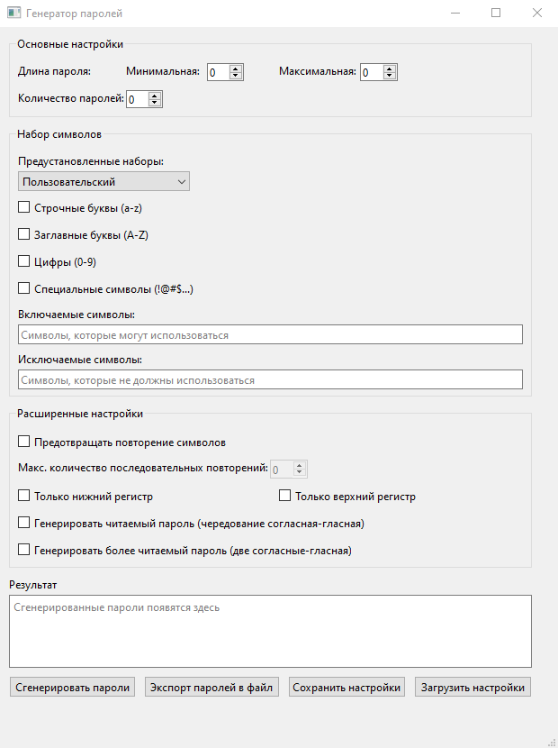

# Password Generator

C++/Qt приложение для генерации паролей с гибкой настройкой алгоритмов и символов.

## Возможности

*   **Гибкие алгоритмы генерации:**
    *   **Стандартный:** Случайный набор символов для максимальной криптостойкости.
    *   **Более читаемый:** Генерация по паттерну "согласная-согласная-гласная" для создания легко запоминаемых псевдо-слов.
    *   **Читаемый:** Строгое чередование гласных и согласных.

*   **Детальная настройка символов:**
    *   Выбор базовых наборов (`a-z`, `A-Z`, `0-9`, `!@#...`).
    *   Ручная корректировка итогового набора символов.
    *   Список исключений для удаления неоднозначных символов (например, `O`, `0`, `l`, `1`).

*   **Дополнительные правила:**
    *   Ограничение на максимальное число идущих подряд одинаковых символов.
    *   Принудительное приведение пароля к верхнему или нижнему регистру.

*   **Управление профилями и результатами:**
    *   Сохранение и загрузка всех настроек в формате `.json`.
    *   Экспорт сгенерированных паролей в текстовый файл (`.txt`).

## Стек технологий

*   **C++**
*   **Qt 6 (Widgets)**
*   **Qt Creator (IDE)**

## Сборка и запуск

1.  Клонировать репозиторий: `git clone https://github.com/coldw1nd/PasswordGenerator`
2.  Открыть файл `PasswordGenerator.pro` в Qt Creator.
3.  Нажать "Запустить".
